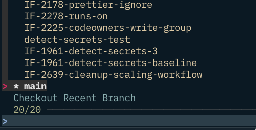
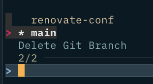

Zsh Configuration and Plugins - Part two

_You can find the first post in this series [here](/2022/11/zsh-configuration-and-plugins-part-one/)._

---

# Functions

Many of my functions start out as aliases and then I convert them to functions when I need to add more functionality. You can find these in [9-function.rc](https://github.com/sammcj/zsh-bootstrap/blob/master/9-functions.rc).

---

```bash
pdfcompress ()
{
  gs -q -dNOPAUSE -dBATCH -dSAFER -sDEVICE=pdfwrite -dCompatibilityLevel=1.3 -dPDFSETTINGS=/screen -dEmbedAllFonts=true -dSubsetFonts=true -dColorImageDownsampleType=/Bicubic -dColorImageResolution=144 -dGrayImageDownsampleType=/Bicubic -dGrayImageResolution=144 -dMonoImageDownsampleType=/Bicubic -dMonoImageResolution=144 -sOutputFile="$1".compressed.pdf "$1";
}
```

```bash
function echoerr() {
  printf "%s\n" "$*" >&2;
}
```

---

## Navigation

### `fcd`

Interactive cd using fzf

```bash
function fcd() {
  local dir;

  while true; do
    # exit with ^D
    dir="$(ls -a1p | grep '/$' | grep -v '^./$' | fzf --height 40% --reverse --no-multi --preview 'pwd' --preview-window=up,1,border-none --no-info)"
    if [[ -z "${dir}" ]]; then
      break
    else
      cd "${dir}" || exit
    fi
  done
}
```

---

## Creation Functions

### `tch`

Touches all files passed in as arguments, if the directory specified doesn't exist it will be created.

```bash
tch() {
  for x in "$@"; do
    __mkdir "${x:h}"
  done
  touch "$@"
}
```

---

## AWS Functions

### AWS Azure AD login

#### `aws-azure-login`

Authenticates to AWS using Azure AD and sets the profile.

```bash
function aws-azure-login() {
  command aws-azure-login --no-prompt --profile "$@"
  export AWS_PROFILE=$@
  export AWSCLIPARAMS="--profile=$@"
}
```

#### `s2a`

Authenticates to AWS using saml2aws and sets the profile.

```bash
function s2a { eval $($(which saml2aws) script --shell=bash --profile=$@); }
```

```bash
function awslogin() {
  if [ -z "${1}" ]; then
    echo "ERROR: account name required, e.g. awslogin data-dev"
  else
    # Check credentials are current, refresh if needed and export into shell
    aws configure list --profile "${1}" && eval $(saml2aws script --profile "${1}")
  fi
}
```

---

## Encryption Functions

### `encrypt_file_pw`

File with generated password using age.

```bash
encrypt_file_pw() {
  if ! command -v age &> /dev/null; then
    echo "age could not be found. Install it with 'brew install age'"
    return
  else
    age -p "$1" -o "${1}.age"
  fi
}
```

#### `keychain_password`

Reads a password from keychain and outputs it

usage: `keychain_password <service name to match on> <account>`

```bash
keychain_password() {
  # Make sure there no screen recording active on before returning the password
  if [[ $(pgrep -i screencapture) ]]; then
    echo "ERROR: macOS screen recording (screencapture process) is active. Please stop it before printing the password."
    return 1
  fi
  security find-generic-password -s "$1" -a "$(whoami)" -w
}
```

#### `keychain_password_prompt`

Prompts for a name and a password and stores it in keychain

```bash
keychain_password_prompt() {
  echo "Enter a name for the password:"
  read -r name
  echo "Enter the password:"
  # disable echoing the password
  stty -echo
  read -r password
  security add-generic-password -s "$name" -a "$(whoami)" -w "$password"
}
```

#### `ssh-add-keys`

A function that checks ssh-add and adds my keys if they're not already added

```bash
function ssh-add-keys() {
  if ! ssh-add -l|grep -qe 'ED25519\|RSA'; then
    ssh-add --apple-use-keychain ~/.ssh/id_*.key
  fi
}

```

---

## Misc Functions

### `list_env`

list env variables with fzf

```bash
list_env() {
  var=$(printenv | cut -d= -f1 | fzf) \
    && echo "$var=$(printenv "$var")" \
    && unset var
}
```

### `update_asdf`

```bash
function update_asdf() {
  asdf update
  asdf plugin-update --all
}
```

### `__mkdir`

Creates a directory if it doesn't exist.

- Alias: `mkcd`

```bash
__mkdir() { if [[ ! -d $1 ]]; then mkdir -p "$1"; fi }
```

### `mv`

Usage: `mv oldfilename`

If you call mv without the second parameter it will prompt you to edit the filename on command line, useful when you want to change just a few letters in a long name.

```bash
function mv() {
  if [ "$#" -ne 1 ]; then
    command mv "$@"
    return
  fi
  if [ ! -f "$1" ]; then
    command file "$@"
    return
  fi

  read -ei "$1" newfilename
  mv -v "$1" "$newfilename"
}
```

### `clean_string`

```shell
clean_string() {
    # Escape special characters in a string such as $, ", ', `, \, and newline.
    # Usage: escape_string "string to escape"
    local string="${1}"
    local escaped_string
    escaped_string=$(printf '%q' "${string}")
    echo "${escaped_string}"
}
```

---

## Git Functions

### `gitlazy`

Adds, commits and pushes all changes in the current directory with the first argument as the commit message

```bash
function gitlazy() {
  git add .
  git commit -a -m "$1"
  git push
}
```

### `gco`

Checks out a branch when provided a branch name, or will prompt to select a branch using fzf.



```bash
function gco(){
  if [[ -n $1 ]]; then
    if [[ $1 == "-b" ]]; then
      # shift to remove -b from args
      shift 1
    fi
    # check to see if the branch exists, if it doesn't offer to create it and check it out otherwise just check it out
    if git branch -a | grep -q "remotes/origin/$1"; then
      git checkout "$1"
    else
      echo "Creating branch $1"
      git checkout -b "$1"
    fi
  else
    git branch --sort=-committerdate | fzf --header 'Checkout Recent Branch' --preview 'git diff --color=always {1}' --pointer='>' | xargs git checkout
  fi
}
```

### `gbd`

Deletes a branch when provided a branch name, or will prompt to select a branch to delete using fzf.



```bash
function gbd(){
  if [[ -n $* ]]; then
    git branch -d "$@"
  else
    git branch --sort=-committerdate | fzf --header 'Delete Git Branch' --preview 'git diff --color=always {1}' --pointer='>' | xargs git branch delete
  fi
}
```

### `checkout-hotfix`

Checks out a hotfix branch with the current date and user.

- Alias: `coh`

```bash
function checkout-hotfix() {
  git checkout -b "Hotfix-$(date +%Y-%m-%d)-${USER}"
}
```

### `commit-hotfix`

Commits a hotfix branch with the current date and user.

- Alias: `ch`

```bash
function commit-hotfix() {
  git add .
  git commit -m "Hotfix-$(date +%Y/%m/%d): $*"
}
```

### `checkout-jira`

Checks out a branch with the provided JIRA ticket number along with the current date and user.

- Alias: `coj`

```bash
function checkout-jira() {
  JIRA_TICKET_PREFIX="IF"
  git checkout -b "${JIRA_TICKET_PREFIX}-${1}-${USER}-$(date +%Y-%m-%d)"
}
```

### `commit-jira`

Takes the JIRA card number from the start of the branch name for the commit message (e.g. IF-1234 from the branch IF-1234-feature-name)

- Alias: `cj`.

```bash
function commit-jira(){
  git add .
  git commit -m "$(git rev-parse --abbrev-ref HEAD | cut -d'-' -f1 -f2) -- $*"
}
```

### `pr-checkout`

Checks out a pull request from GitHub using the GitHub CLI.

```bash
function pr-checkout() {
  local jq_template pr_number

  jq_template='"'\
'#\(.number) - \(.title)'\
'\t'\
'Author: \(.user.login)\n'\
'Created: \(.created_at)\n'\
'Updated: \(.updated_at)\n\n'\
'\(.body)'\
'"'

  pr_number=$(
    gh api 'repos/:owner/:repo/pulls' |
    jq ".[] | $jq_template" |
    sed -e 's/"\(.*\)"/\1/' -e 's/\\t/\t/' |
    fzf \
      --with-nth=1 \
      --delimiter='\t' \
      --preview='echo -e {2}' \
      --preview-window=top:wrap |
    sed 's/^#\([0-9]\+\).*/\1/'
  )

  if [ -n "$pr_number" ]; then
    gh pr checkout "$pr_number"
  fi
}
```

### `git_add_commit_push`

Git checkout new branch, git add, git commit, git push in all subdirectories matching a pattern

- Alias: `gacp`

```bash
function git_add_commit_push(){
  if [[ -z $1 ]] || [[ -z "$2" ]] || [[ -z "$3" ]]; then
    echo 'You must pass three paramters, branchname, commit message, dir match - e.g. "my-branch" "commit message" ABC*';
  fi
  BRANCHNAME="$1"
  COMMITNAME="$2"
  MATCHDIRS="$3"
  for dir in $MATCHDIRS;
    do (
      cd "$dir" &&
      git checkout -b "$BRANCHNAME" &&
      git add . &&
      git commit -n -m "$COMMITNAME" &&
      git push
      )
    done
}
```

#### `ghac`

Deletes workflow logs from a given repo older than 1 month

Usage: `USER=myuser REPO=myrepo ghac`

```bash
function ghac() {
  DATE=$(date -v "-1m" +"%Y-%m-%d") gh api "repos/${USER}/${REPO}/actions/runs" --paginate -q '.workflow_runs[] | select (.run_started_at  <= "env.DATE") | (.id)' \
    | xargs -n1 -I % gh api "repos/${USER}/${REPO}/actions/runs"/% -X DELETE
}
```

### Git Meta-Functions

> The following Git functions are mainly consumed by other functions or the prompt.

```bash
function git_prompt_info() {
  local ref
  if [[ "$(command git config --get oh-my-zsh.hide-status 2>/dev/null)" != "1" ]]; then
    ref=$(command git symbolic-ref HEAD 2> /dev/null) || \
    ref=$(command git rev-parse --short HEAD 2> /dev/null) || return 0
    echo "$ZSH_THEME_GIT_PROMPT_PREFIX${ref#refs/heads/}$(parse_git_dirty)$ZSH_THEME_GIT_PROMPT_SUFFIX"
  fi
}
```

Outputs the name of the current branch

```bash
function git_current_branch() {
  local ref
  ref=$(command git symbolic-ref --quiet HEAD 2> /dev/null)
  local ret=$?
  if [[ $ret != 0 ]]; then
    [[ $ret == 128 ]] && return  # no git repo.
    ref=$(command git rev-parse --short HEAD 2> /dev/null) || return
  fi
  echo "${ref#refs/heads/}"
}
```

Gets the number of commits ahead from remote

```bash
function git_commits_ahead() {
  if command git rev-parse --git-dir &>/dev/null; then
    local commits
    commits="$(git rev-list --count @{upstream}..HEAD)"
    if [[ "$commits" != 0 ]]; then
      echo "$ZSH_THEME_GIT_COMMITS_AHEAD_PREFIX$commits$ZSH_THEME_GIT_COMMITS_AHEAD_SUFFIX"
    fi
  fi
}
```

Gets the number of commits behind remote

```bash
function git_commits_behind() {
  if command git rev-parse --git-dir &>/dev/null; then
    local commits
    commits="$(git rev-list --count HEAD..@{upstream})"
    if [[ "$commits" != 0 ]]; then
      echo "$ZSH_THEME_GIT_COMMITS_BEHIND_PREFIX$commits$ZSH_THEME_GIT_COMMITS_BEHIND_SUFFIX"
    fi
  fi
}
```

Outputs if current branch is ahead of remote

```bash
function git_prompt_ahead() {
  if [[ -n "$(command git rev-list origin/"$(git_current_branch)"..HEAD 2> /dev/null)" ]]; then
    echo "$ZSH_THEME_GIT_PROMPT_AHEAD"
  fi
}
```

Outputs if current branch is behind remote

```bash
function git_prompt_behind() {
  if [[ -n "$(command git rev-list HEAD..origin/"$(git_current_branch)" 2> /dev/null)" ]]; then
    echo "$ZSH_THEME_GIT_PROMPT_BEHIND"
  fi
}
```

Outputs if current branch exists on remote or not

```bash
function git_prompt_remote() {
  if [[ -n "$(command git show-ref origin/"$(git_current_branch)" 2> /dev/null)" ]]; then
    echo "$ZSH_THEME_GIT_PROMPT_REMOTE_EXISTS"
  else
    echo "$ZSH_THEME_GIT_PROMPT_REMOTE_MISSING"
  fi
}
```

Formats prompt string for current git commit short SHA

```bash
function git_prompt_short_sha() {
  local SHA
  SHA=$(command git rev-parse --short HEAD 2> /dev/null) && echo "$ZSH_THEME_GIT_PROMPT_SHA_BEFORE$SHA$ZSH_THEME_GIT_PROMPT_SHA_AFTER"
}
```

Formats prompt string for current git commit long SHA

```bash
function git_prompt_long_sha() {
  local SHA
  SHA=$(command git rev-parse HEAD 2> /dev/null) && echo "$ZSH_THEME_GIT_PROMPT_SHA_BEFORE$SHA$ZSH_THEME_GIT_PROMPT_SHA_AFTER"
}
```

Get the status of the working tree

```bash
function git_prompt_status() {
  local INDEX STATUS
  INDEX=$(command git status --porcelain -b 2> /dev/null)
  STATUS=""
  if eval "$(echo "$INDEX" | command grep -E '^\?\? ' &> /dev/null)"; then
    STATUS="$ZSH_THEME_GIT_PROMPT_UNTRACKED$STATUS"
  fi
  if eval "$(echo "$INDEX" | grep '^A  ' &> /dev/null)"; then
    STATUS="$ZSH_THEME_GIT_PROMPT_ADDED$STATUS"
  elif eval "$(echo "$INDEX" | grep '^M  ' &> /dev/null)"; then
    STATUS="$ZSH_THEME_GIT_PROMPT_ADDED$STATUS"
  fi
  if eval "$(echo "$INDEX" | grep '^ M ' &> /dev/null)"; then
    STATUS="$ZSH_THEME_GIT_PROMPT_MODIFIED$STATUS"
  elif eval "$(echo "$INDEX" | grep '^AM ' &> /dev/null)"; then
    STATUS="$ZSH_THEME_GIT_PROMPT_MODIFIED$STATUS"
  elif eval "$(echo "$INDEX" | grep '^ T ' &> /dev/null)"; then
    STATUS="$ZSH_THEME_GIT_PROMPT_MODIFIED$STATUS"
  fi
  if eval "$(echo "$INDEX" | grep '^R  ' &> /dev/null)"; then
    STATUS="$ZSH_THEME_GIT_PROMPT_RENAMED$STATUS"
  fi
  if eval "$(echo "$INDEX" | grep '^ D ' &> /dev/null)"; then
    STATUS="$ZSH_THEME_GIT_PROMPT_DELETED$STATUS"
  elif eval "$(echo "$INDEX" | grep '^D  ' &> /dev/null)"; then
    STATUS="$ZSH_THEME_GIT_PROMPT_DELETED$STATUS"
  elif eval "$(echo "$INDEX" | grep '^AD ' &> /dev/null)"; then
    STATUS="$ZSH_THEME_GIT_PROMPT_DELETED$STATUS"
  fi
  if eval "$(command git rev-parse --verify refs/stash >/dev/null 2>&1)"; then
    STATUS="$ZSH_THEME_GIT_PROMPT_STASHED$STATUS"
  fi
  if eval "$(echo "$INDEX" | grep '^UU ' &> /dev/null)"; then
    STATUS="$ZSH_THEME_GIT_PROMPT_UNMERGED$STATUS"
  fi
  if eval "$(echo "$INDEX" | grep '^## [^ ]\+ .*ahead' &> /dev/null)"; then
    STATUS="$ZSH_THEME_GIT_PROMPT_AHEAD$STATUS"
  fi
  if eval "$(echo "$INDEX" | grep '^## [^ ]\+ .*behind' &> /dev/null)"; then
    STATUS="$ZSH_THEME_GIT_PROMPT_BEHIND$STATUS"
  fi
  if eval "$(echo "$INDEX" | grep '^## [^ ]\+ .*diverged' &> /dev/null)"; then
    STATUS="$ZSH_THEME_GIT_PROMPT_DIVERGED$STATUS"
  fi
  echo "$STATUS"
}
```

Compares the provided version of git to the version installed and on path outputs -1, 0, or 1 if the installed version is less than, equal to, or greater than the input version, respectively

```bash
function git_compare_version() {
  local INPUT_GIT_VERSION INSTALLED_GIT_VERSION
  INPUT_GIT_VERSION=(${(s/./)1})
  INSTALLED_GIT_VERSION=($(command git --version 2>/dev/null))
  INSTALLED_GIT_VERSION=(${(s/./)INSTALLED_GIT_VERSION[3]})

  for i in {1..3}; do
    if [[ ${INSTALLED_GIT_VERSION[$i]} -gt ${INPUT_GIT_VERSION[$i]} ]]; then
      echo 1
      return 0
    fi
    if [[ ${INSTALLED_GIT_VERSION[$i]} -lt ${INPUT_GIT_VERSION[$i]} ]]; then
      echo -1
      return 0
    fi
  done
  echo 0
}
```

Outputs the name of the current user

```bash
function git_current_user_name() {
  command git config user.name 2>/dev/null
}
```

Outputs the email of the current user

```bash
function git_current_user_email() {
  command git config user.email 2>/dev/null
}
```
